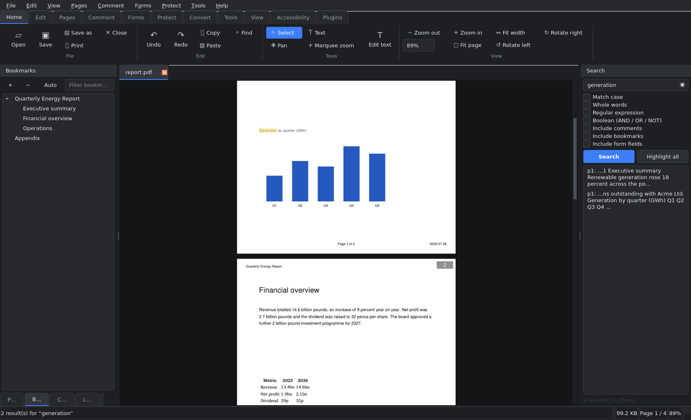

# PDF Studio

A professional-grade, cross-platform PDF editor written in Python with PySide6
and PyMuPDF. It aims at the feature level of Acrobat Pro, Foxit and PDF-XChange
while staying scriptable, embeddable and fully open.



---

## Highlights

| Area | What you get |
| --- | --- |
| **Viewing** | Virtualised canvas (100 000+ pages), single/continuous/facing/book layouts, presentation mode, pinch & marquee zoom, tiled rendering, disk + memory caches, prefetching |
| **Editing** | Edit existing text in place, rich-text boxes, find & replace (regex), image insert/replace/crop/adjust, vector drawing, gradients, SVG import |
| **Pages** | Insert, delete, move, rotate, crop, resize, duplicate, extract, replace, split, merge, N-up, booklet imposition, page labels |
| **Comments** | Highlight, underline, strikeout, squiggly, notes, free text, callouts, ink, shapes, polygons, clouds, stamps, measurements, replies, review states, XFDF/JSON import & export |
| **Forms** | Create and fill every AcroForm widget, validation, safe calculations, QR/barcodes, FDF/XFDF/JSON/CSV data, mail-merge, flattening |
| **Security** | AES-256/128 & RC4 encryption, permissions, true redaction, sanitisation, watermarks, Bates numbering, headers/footers, PKCS#12 signatures and validation (pyHanko) |
| **OCR** | Tesseract, EasyOCR and MuPDF back-ends, deskew, denoise, binarisation, invisible searchable text layer, confidence reporting |
| **AI** | Works offline: extractive summaries, BM25 question answering with page citations, keyword tagging, bookmark generation, metadata suggestions, grammar checks. Optional OpenAI-compatible endpoint for translation and rewriting |
| **Conversion** | Import DOCX/PPTX/XLSX/RTF/HTML/Markdown/EPUB/CBZ/images/RAW/HEIC; export DOCX, PPTX, PNG/JPEG/TIFF/WEBP, SVG, TXT, HTML, Markdown, CSV tables, PDF/A, PDF/X, PDF/UA |
| **Automation** | Batch pipelines, full CLI, Python scripting console, plugin API with sandboxing and hot reload |
| **Quality** | Unlimited undo with macros and snapshots, autosave with crash recovery, accessibility checker, document comparison, size analysis and optimisation |

---

## Installation

### From source

```bash
git clone https://github.com/pdfstudio/pdfstudio.git
cd pdfstudio
python -m venv .venv && source .venv/bin/activate   # Windows: .venv\Scripts\activate
pip install -e ".[full,dev]"
pdfstudio
```

Python **3.13 or newer** is required.

### Minimal install

```bash
pip install pdfstudio            # viewer + editor + CLI
pip install "pdfstudio[ocr]"     # + Tesseract OCR
pip install "pdfstudio[full]"    # everything
```

### Optional system dependencies

| Feature | Requirement |
| --- | --- |
| OCR | `tesseract-ocr` (plus language packs, e.g. `tesseract-ocr-fra`) |
| High-fidelity Office import/export | LibreOffice (`soffice` on `PATH`) |
| Certified PDF/A and PDF/X | Ghostscript (`gs`) |
| Digital signatures | `pip install "pdfstudio[signatures]"` |

Everything degrades gracefully: missing optional tools produce a clear message
naming the package to install, never a crash.

---

## Usage

### Graphical editor

```bash
pdfstudio                      # empty session
pdfstudio report.pdf           # open a file
pdfstudio *.pdf --theme light  # several tabs, light theme
pdfstudio --safe-mode          # defaults, no plugins, no session restore
```

### Command line

```bash
pdfstudio-cli info report.pdf --verbose
pdfstudio-cli merge a.pdf b.pdf -o merged.pdf
pdfstudio-cli split report.pdf -o parts/ --pages-per-file 10
pdfstudio-cli ocr scan.pdf -o searchable.pdf --lang eng+fra
pdfstudio-cli compress big.pdf -o small.pdf --profile screen
pdfstudio-cli encrypt secret.pdf -o locked.pdf --password 'hunter2' --read-only
pdfstudio-cli watermark in.pdf -o out.pdf --text DRAFT --tile
pdfstudio-cli search "invoice \d+" *.pdf --regex --json
pdfstudio-cli batch inbox/*.pdf -o outbox/ --ops ocr,watermark,compress
```

Every command supports `--json` for scripting and returns meaningful exit codes
(`0` success, `1` failure or "no matches", `2` usage error).

### As a library

```python
from pdfstudio.pdfengine.document import PdfDocument
from pdfstudio.pdfengine.annotations import AnnotationService
from pdfstudio.pdfengine.search import SearchService

with PdfDocument.open("contract.pdf") as doc:
    for hit in SearchService(doc).search("confidential"):
        AnnotationService(doc).highlight_text(hit.page, hit.text)
    doc.save_as("reviewed.pdf")
```

---

## Architecture

```
pdfstudio/
├── core/         settings, logging, events, undo, jobs, paths   (no Qt, no PDF)
├── pdfengine/    document model, pages, content, annotations,
│                 forms, security, search, convert, optimize
├── render/       rasteriser, tiling, memory + disk caches
├── ocr/          pluggable OCR engines and pre-processing
├── ai/           offline and remote document intelligence
├── services/     history, autosave/recovery, batch processing
├── plugins/      public API, loader, sandbox, built-in plugins
├── ui/           PySide6 views, panels, dialogs, theme engine
├── cli.py        head-less command-line interface
└── app.py        application bootstrap
```

Only `pdfstudio.ui` imports Qt. Every feature is reachable from the head-less
layers, which is why the CLI, the plugin API and the test-suite can drive the
whole product without a display.

See [`docs/architecture.md`](docs/architecture.md) for the full design, the
threading model and the undo strategy.

---

## Documentation

* [User manual](docs/user-manual.md) — every feature, with keyboard shortcuts
* [Developer guide](docs/developer-guide.md) — architecture, extending, testing
* [Plugin guide](docs/plugins.md) — the plugin API with worked examples
* [API reference](docs/api-reference.md) — the head-less Python API
* [Troubleshooting](docs/troubleshooting.md) — diagnostics and common problems
* [Deployment](docs/deployment.md) — packaging and distribution

---

## Development

```bash
pip install -e ".[full,dev]"
pytest                            # full suite
pytest -m "not slow"              # quick run
pytest -m benchmark -s            # performance report
pytest --cov=src/pdfstudio        # coverage
ruff check src tests && mypy src  # lint and types
```

### Building installers

```bash
python packaging/build.py --target auto      # native package for this platform
python packaging/build.py --target appimage  # Linux AppImage
python packaging/build.py --target msi       # Windows installer
python packaging/build.py --target dmg       # macOS disk image
```

---

## Licence

MIT — see [`LICENSE`](LICENSE).

PDF Studio builds on PyMuPDF (AGPL/commercial), PySide6 (LGPL), pikepdf,
Pillow, NumPy and loguru. Review the licences of your chosen optional
dependencies before redistributing.
